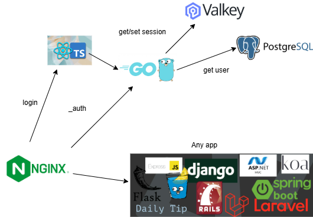

Реализуем Single Sign-On в рамках одного сервера с нексолькими приложениями

# Цель
Сокращения дублируещего кода при разработке наскольких проектов на одном сервере. Обеспечение безопасности.

### Личные цели

Изучить GO, TOTP, попробоатать повыписывать сертификаты.

# Задача
Задача проекта создать простой код для закрытия всех приложений за единой системой авторизации. 

# Идеи
Totp при авторизации

https сертификаты для обеспечения безпорольного входа

ValKey хранилище для сессий и MongoDB хранилище для пользователей и их разрешений 

Подумать что делать с уникальными провами/ролями пользователей - мб процесс авторизации нужно отдать приложениям 

Регистрация пользователя через суперадмина

Попробовать swaggo/gin-swagger для генерации кода для фронта (openapi generator)

# Пример флоу незарегестрированного пользователя

# Стек
Go для auth приложения 

React и TS для формы авторизации/регистрации

nginx в качестве reverse прокси

# Схема БД
table User
* id
* login
* password_hash
* registration date
* totp secret
